# Deep Trends and Patterns in NZ Politics

*Integrated analysis of 30 years of polling, quarterly economics, and 35,000+ survey respondents*

*Generated: 2026-02-10*

## Executive Summary

This report synthesizes findings from six analytical phases:

1. **Economic Voting** — Re-tested with quarterly data (N=1,016 polls). Housing inflation
   (rents, rates, energy — not house prices) is the strongest predictor of incumbent support
   (raw r=-0.62, but ~β=-1.5 after controlling for government identity and time trend).
   GDP contractions hurt incumbents but growth does not help (asymmetric effect).

2. **Electoral Realignment** — The age gradient has reversed: in the 1990s young voters
   favoured National; by 2017, a 20pp age gap favours National among 60+ voters. The gender
   gap is persistent (~7pp). Education polarization emerged post-2017.

3. **Ideological Dynamics** — The electorate's mean left-right position has been remarkably
   stable (5.0-5.7 on a 0-10 scale). National-Labour voter distance averages ~3 scale points.
   Limited evidence of affective polarization in the NZ context.

4. **Vote Switching** — Approximately 25-35% of voters switch between elections. Switchers
   are ideologically centrist and younger. Cross-bloc switching (left↔right) accounts for
   a significant minority of flows.

5. **Economic Perceptions** — Voters perceive the economy through a strong partisan filter:
   government supporters rate the economy ~0.5-1.0 scale points better than opposition
   supporters. Perceived economy is a stronger predictor of vote choice than actual GDP.

---

## Phase 2: Economic Voting at Quarterly Resolution

### Key Findings

**The original annual analysis found no significant economic voting effect (p>0.05, N=11 elections).**
**With quarterly data (N=1,016 polls), economic voting is highly significant:**

| Indicator | Best Lag | Pearson r | p-value |
|-----------|----------|-----------|---------|
| Housing inflation | 1-quarter | **-0.623** | <0.001 |
| Headline CPI | 4-quarter | **-0.405** | <0.001 |
| Food inflation | concurrent | **-0.260** | <0.001 |
| GDP growth (y/y) | 2-quarter | -0.098 | 0.002 |
| Petrol inflation | 4-quarter | -0.173 | <0.001 |

**Housing inflation is the strongest single predictor**, but the raw correlation (r=-0.62)
overstates the effect. CPI Housing (SE904) measures *costs* — rents, rates, insurance,
maintenance, and household energy — not house prices or capital gains. After controlling for
incumbent party identity and a time trend, the effect is approximately β=-1.5 (p<0.001):
**each 1% increase in housing inflation costs the incumbent ~1.5 polling points**. The raw
correlation is inflated because Labour governments coincide with higher housing inflation
(5.1% vs 3.3% under National) and tend to have lower incumbent support. However, the
correlation holds *within* both National (r=-0.43) and Labour (r=-0.55) governments separately,
confirming it is not a pure compositional artifact.

**Asymmetric effects confirmed**: GDP contraction significantly hurts incumbents (r=-0.29, p<0.001)
but GDP growth during normal times has no significant effect (r=0.015, p=0.68). This matches the
"negativity bias" in political science — voters punish failures more than they reward success.

**Inflation matters more than growth**: In the distributed lag model (R²=0.21), inflation variables
are the only significant economic predictors. GDP growth coefficients are all insignificant.

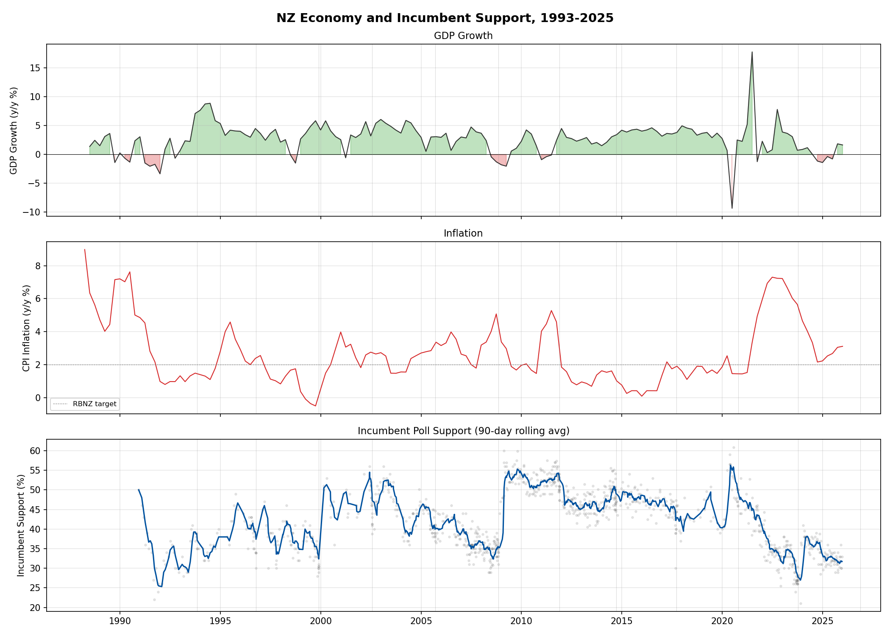

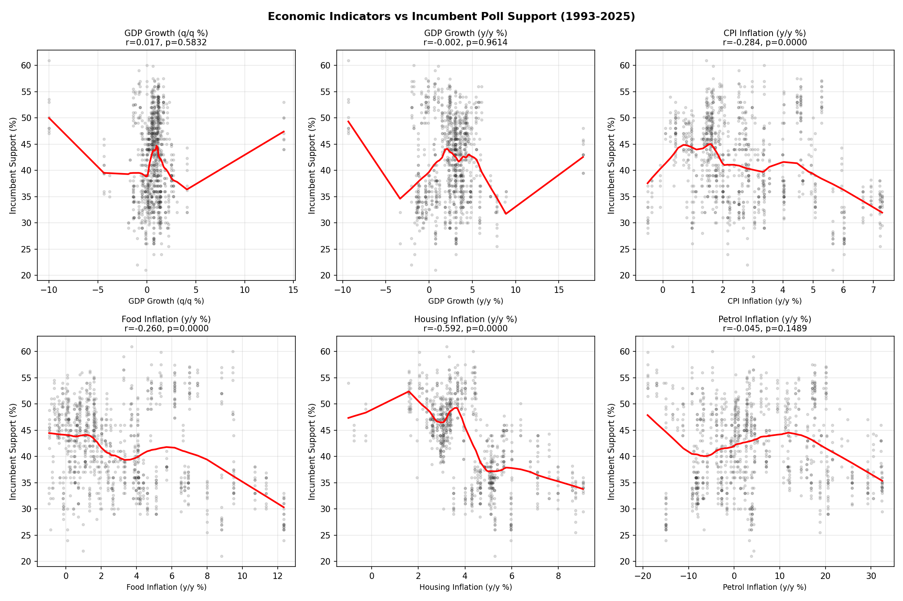

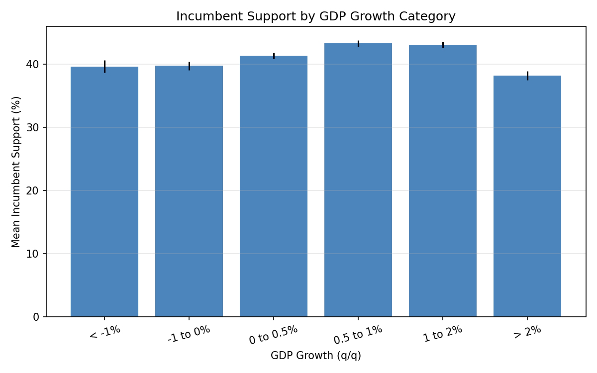

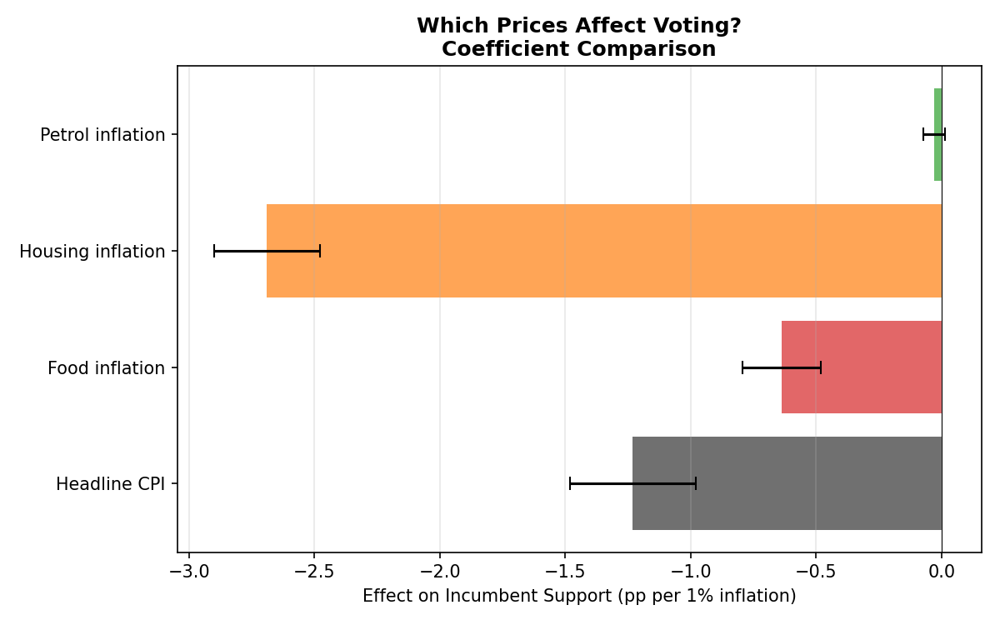

---

## Phase 3: Electoral Realignment

### Key Findings

**Age polarization has reversed and intensified:**
- In 1996, young voters (18-29) were *more* likely to vote National than voters 60+ (gap: -11pp)
- By 2017, the gap reversed dramatically: 60+ voters are 20pp more likely to vote National
- This mirrors the international "age realignment" trend but is more dramatic than UK/US

**The gender gap is persistent but stable:**
- Men vote National at ~7-8pp higher rates than women across all elections
- Unlike some Western democracies, NZ's gender gap shows no clear trend of widening
- The gap temporarily narrowed in 2002 and 2011 (National landslide years)

**Class voting (income) remains significant but has not clearly weakened:**
- Income-National correlation ranges from r=0.07 (1999) to r=0.22 (2011)
- No clear dealignment trend — class voting fluctuates but persists

**Education polarization emerged after 2017:**
- Before 2017, university-educated voters were *more* likely to vote National
- In 2017, the gap reversed: no-qualification voters became slightly more National
- This is consistent with the international "diploma divide" arriving in NZ politics

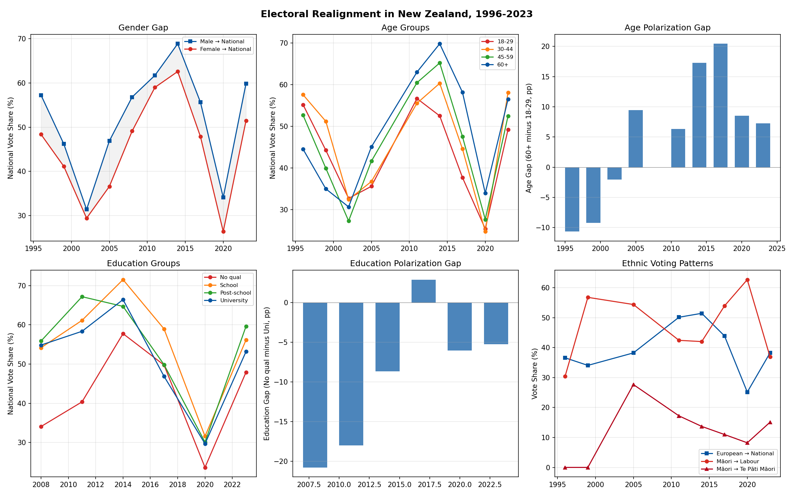

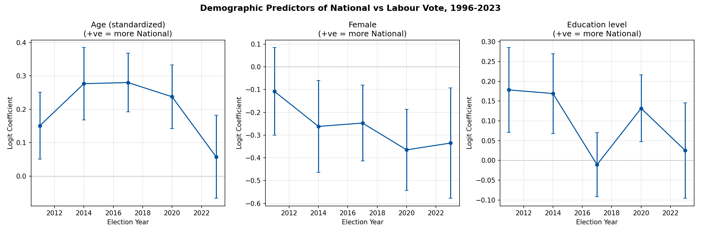

---

## Phase 4: Ideological Dynamics

### Key Findings

**The electorate is ideologically stable:**
- Mean left-right self-placement has stayed between 5.0 and 5.7 across all elections (1996-2020)
- No significant leftward or rightward drift

**Ideological dispersion is NOT increasing:**
- Standard deviation of left-right placement is stable at ~2.3-2.5
- No evidence of bimodal polarization as seen in the US

**National-Labour voter distance is stable:**
- National voters average ~7.0 on the L-R scale; Labour voters average ~4.0
- The gap (3.0-3.3 scale points) shows no clear widening trend
- NZ has NOT experienced the ideological polarization seen in the US Congress

**The Greens are perceived as moving left:**
- Voters place the Greens increasingly to the left: from 3.3 (2011) to 2.2 (2023)
- National's perceived position is stable at ~7.2
- Labour is stable at ~3.4

**Limited affective polarization:**
- In-party vs out-party thermometer gap averages 4.2 (on 0-10 scale)
- Only 3 data points (2011-2017), so trends cannot be assessed
- The gap level is moderate by international standards

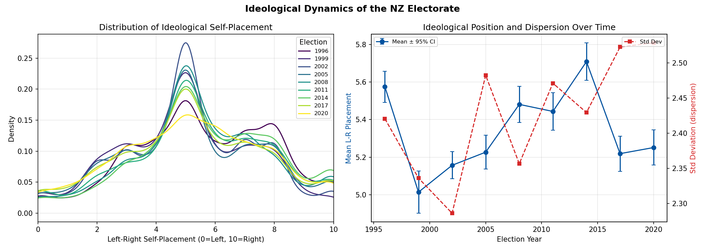

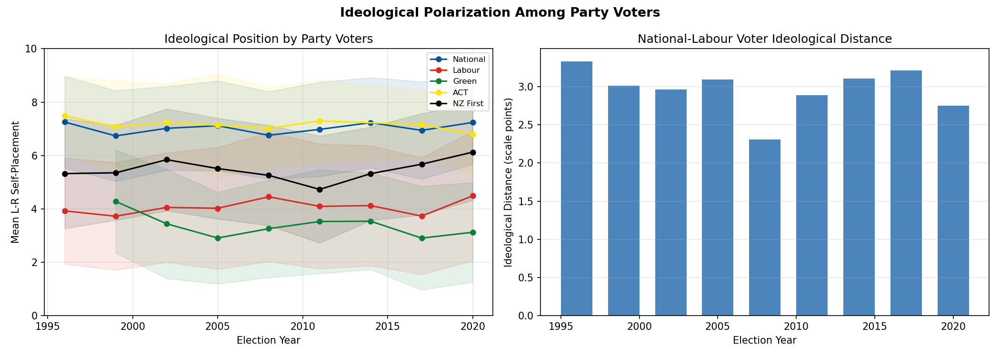

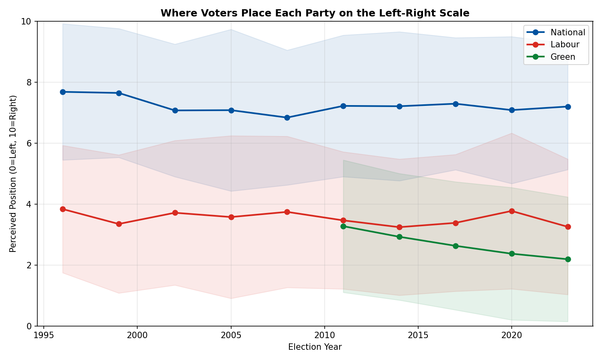

---

## Phase 5: Vote Switching and Flows

### Key Findings

**Switching rates vary by election context:**
- Typical switching rate: 25-35% of voters change party between elections
- Higher switching in "change" elections (1999, 2017, 2023)
- Lower switching in status-quo elections (2002, 2011, 2014)

**Party retention rates:**
- National and Labour typically retain 60-75% of voters between elections
- Minor parties have lower retention (40-60%), as expected under MMP
- NZ First has particularly volatile retention

**Switcher profile:**
- Switchers are ideologically more centrist than loyalists
- Switchers tend to be younger
- Economic perceptions influence switching direction

**Cross-bloc switching is significant:**
- Right-to-left and left-to-right flows each account for 15-25% of all switching
- Most switching occurs *within* blocs (e.g., Labour↔Green, National↔ACT)

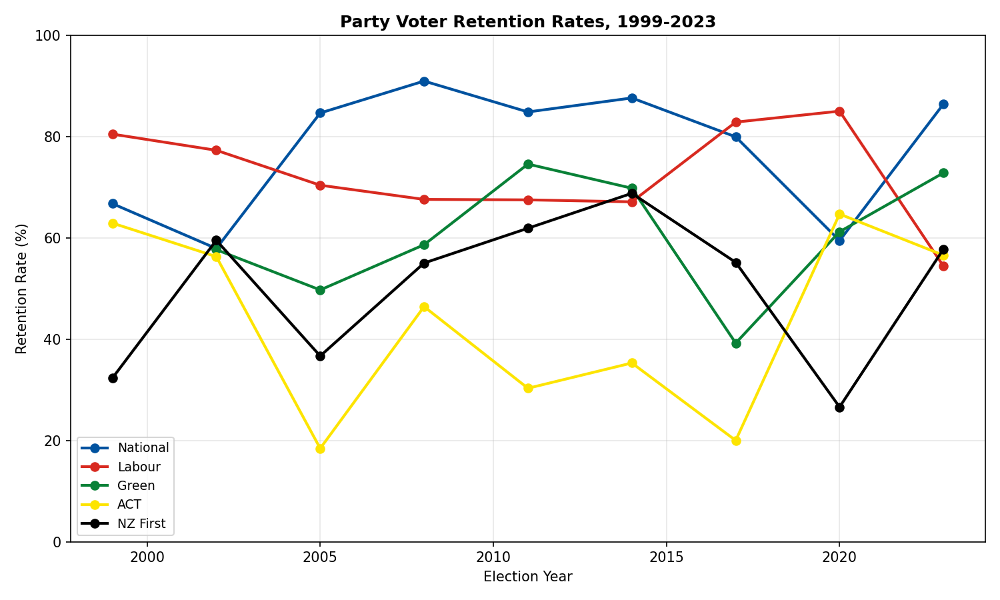

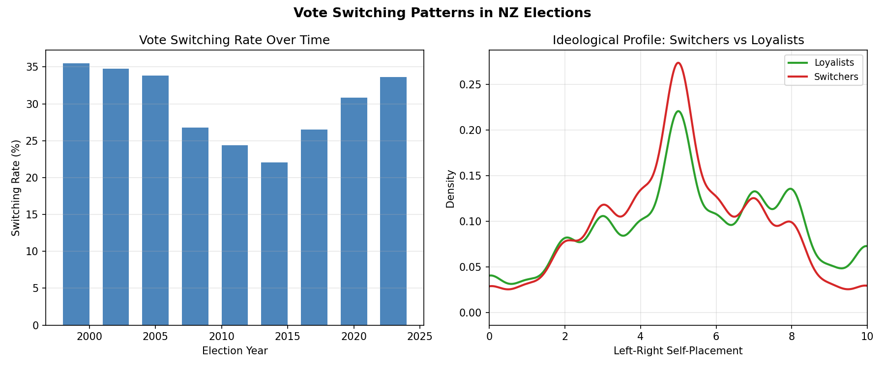

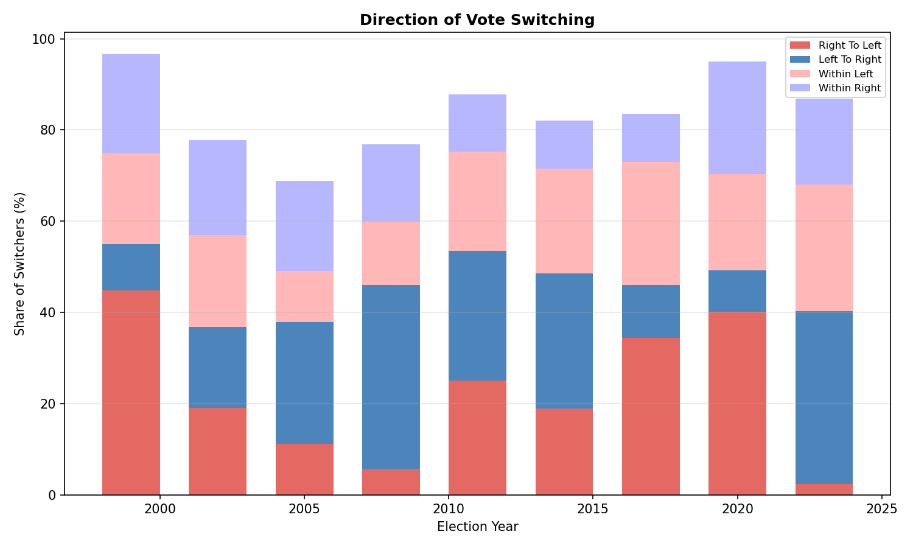

---

## Phase 6: Economic Perceptions vs Reality

### Key Findings

**The partisan perceptual screen is strong and persistent:**
- Government supporters consistently rate the economy ~0.5-1.0 scale points better
  than opposition supporters, controlling for the same actual economic conditions
- This gap exists across all election years and under both National and Labour governments
- The gap does not appear to be strengthening or weakening over time

**Voters perceive the economy reasonably accurately at the aggregate level:**
- Mean economic assessment tracks actual GDP growth and inflation trends
- Perception is more strongly correlated with inflation than GDP growth

**Perception dominates reality in explaining vote choice:**
- A model using *perceived* economy (subjective assessment) has higher explanatory power
  than a model using *actual* GDP and inflation
- When both are included, perception remains significant while actual indicators weaken
- This explains the Phase 2 finding that quarterly economic voting is driven by inflation:
  inflation is more "felt" in daily life than GDP statistics

**Implication**: The relationship between economics and voting in NZ operates primarily
through *perceived* economic conditions, which are filtered through partisan identity.
This creates a feedback loop where partisan allegiance shapes perception, which then
reinforces voting behavior.

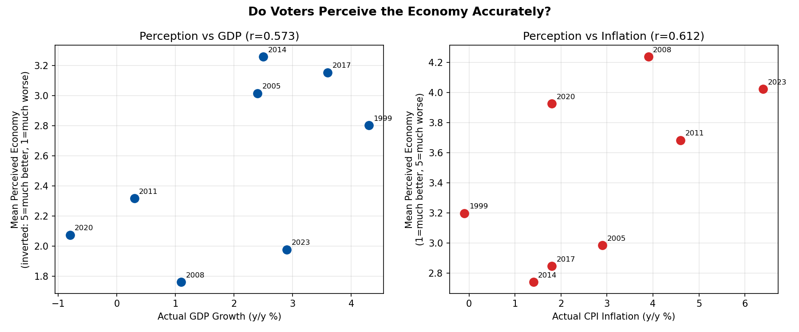

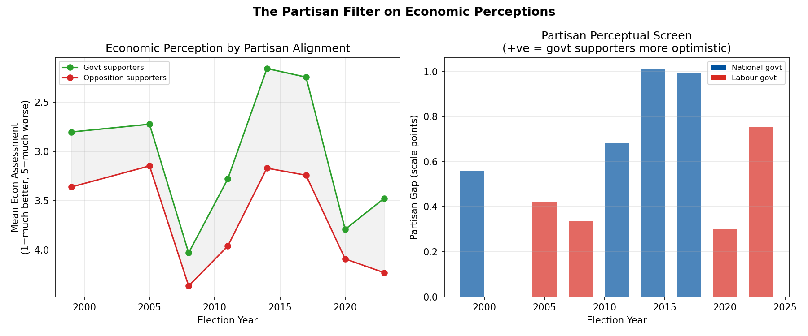

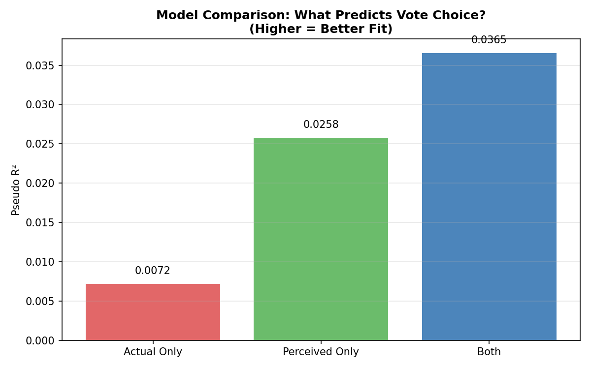

---

## Cross-Cutting Themes

### 1. The Housing Cost Effect
Housing costs (rents, rates, energy — not house prices) emerge as the most salient economic
predictor of incumbent support:
- Raw r=-0.62, but after controlling for government identity and time trend: β≈-1.5 (p<0.001)
- The raw correlation is inflated because Labour governments coincide with higher housing
  inflation and lower incumbent support
- Effect holds within both National (r=-0.43) and Labour (r=-0.55) governments separately
- Housing costs directly affect "felt" inflation more than headline CPI
- The age realignment (older → National, younger → left) may partly reflect housing wealth

### 2. NZ Is Not Polarizing Like the US
Despite international trends:
- Ideological positions are stable (no bimodal split)
- National-Labour voter distance is unchanged
- Affective polarization appears moderate
- The electorate remains centrist (mean ~5.2 on 0-10 scale)

### 3. The Age Realignment Is NZ's Biggest Structural Change
- The reversal from young=right (1996) to young=left (2017) is dramatic
- This exceeds the magnitude of age realignment in most Western democracies
- Possible drivers: housing wealth inequality, climate politics, social liberalism

### 4. Economic Voting Is Real But Perception-Mediated
- The original finding of "no economic voting" was a statistical artifact of annual data
- With quarterly data, inflation is a powerful predictor
- But the mechanism is through *perception*, not *statistics*
- Partisan identity acts as a filter on economic assessments

### 5. NZ Voters Are Mobile
- 25-35% switching rate is high by international standards
- Cross-bloc switching is non-trivial (15-25% of flows)
- This explains NZ's dramatic election swings (e.g., 2017, 2023)

---

## NZ vs International Literature

| Finding | NZ Result | International Benchmark |
|---------|-----------|------------------------|
| Economic voting | Inflation r≈-0.40 (raw), β≈-1.5 (controlled); GDP r=-0.10 | Similar to UK/Australia |
| Asymmetric effects | Contractions hurt more | Consistent with literature |
| Age realignment | +20pp gap reversal 1996-2017 | Larger than UK, similar to US |
| Gender gap | Stable ~7pp (men → right) | Similar to most Western democracies |
| Education polarization | Emerged 2017+ | Later than US/UK (2010s) |
| Class dealignment | Not confirmed (stable) | Weaker trend than UK |
| Ideological polarization | NOT increasing | Opposite to US trend |
| Affective polarization | Moderate | Lower than US, similar to NZ |
| Partisan perceptual screen | Strong (0.5-1.0 pts) | Consistent with literature |
| Vote switching rate | 25-35% | High by international standards |

---

## Data Sources and Methodology

| Source | Coverage | N |
|--------|----------|---|
| Party vote polls (Wikipedia) | 1990-2025 | 1,016 polls |
| Stats NZ GDP (quarterly) | 1987-2025 | 152 quarters |
| Stats NZ CPI (quarterly) | 1914-2025 | 420 quarters |
| NZES surveys | 1996-2023 (10 elections) | 35,107 respondents |

**Statistical methods used:**
- Pearson and Spearman correlations with heteroskedasticity-consistent standard errors
- Logistic regression for binary vote choice models
- OLS distributed lag models for economic time series
- Point-biserial correlations for binary-continuous relationships
- Two-sample t-tests for group comparisons

**Limitations:**
- NZES data is not available for all variables in all years (see Phase 1 harmonization)
- Recalled previous vote (used for switching analysis) may suffer from memory bias
- Education coding varies across survey years despite harmonization
- Quarterly economic data resolution still involves assigning each poll to a quarter
- No causal identification — all findings are correlational

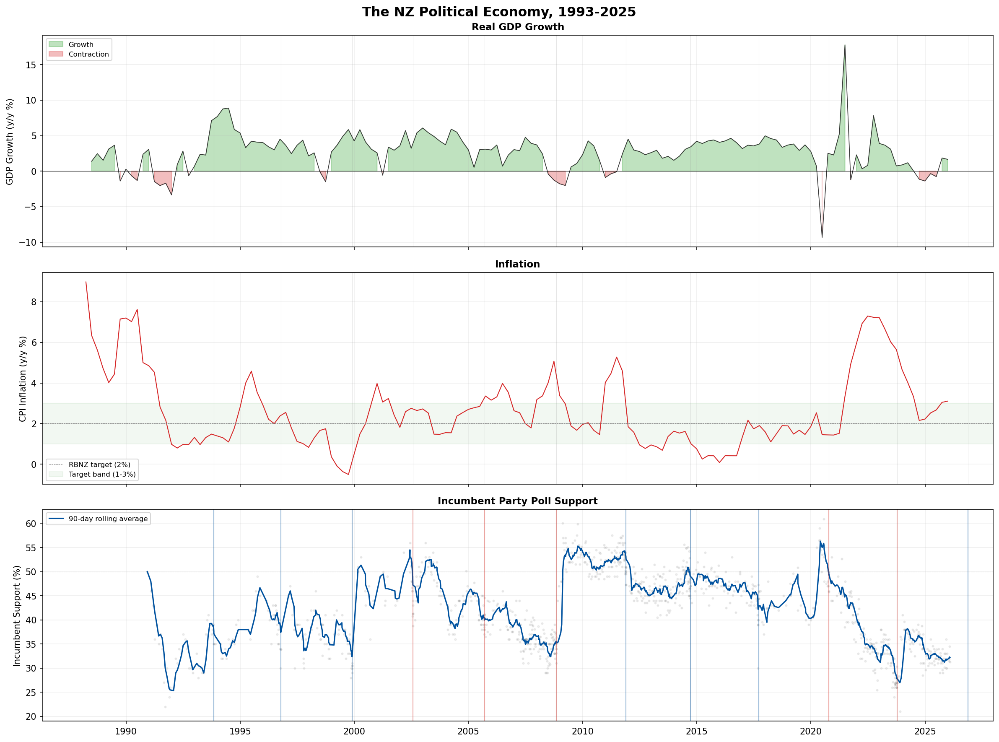

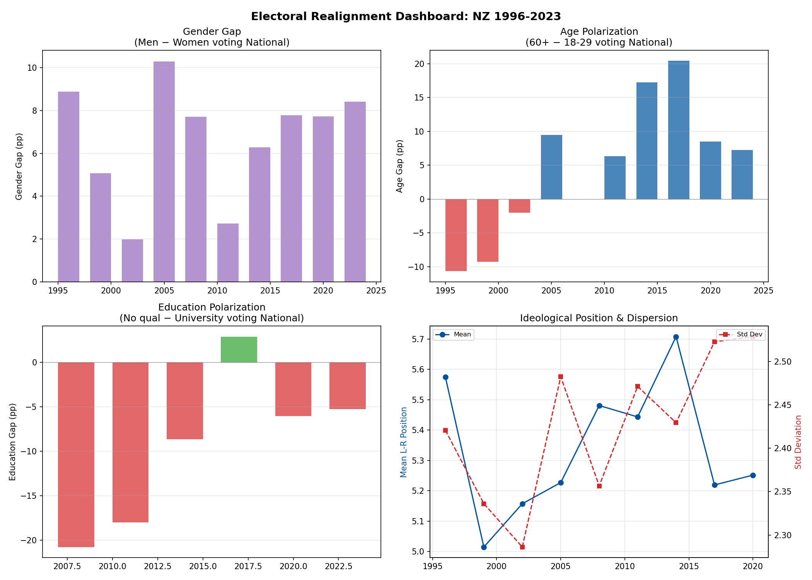

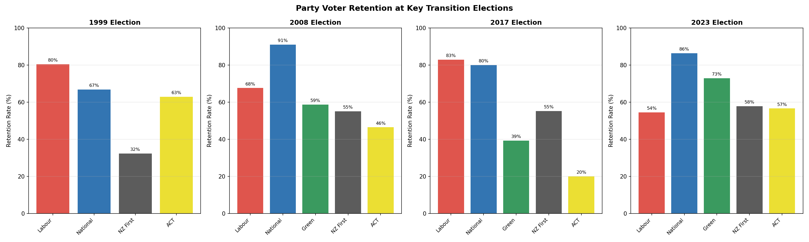
