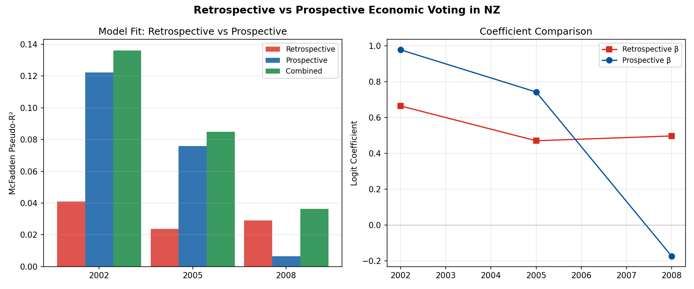
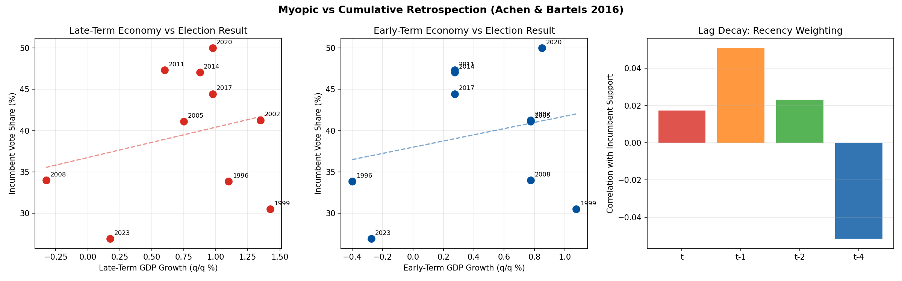
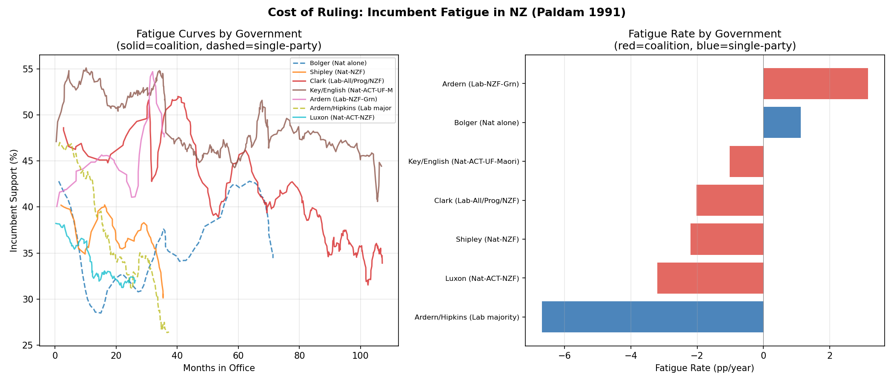

# Economic Voting Extensions

*Three hypotheses from the economic voting literature, tested on NZ data*

## 1A. Retrospective vs Prospective Voting (Fiorina 1981)

**Question**: Do NZ voters look backward or forward when punishing/rewarding incumbents?

The "peasant" model predicts retrospective voting dominates; the "banker's" model predicts prospective voting is stronger, especially among sophisticated voters.

### Pseudo-R² Comparison

| Year | Retro R² | Prosp R² | Combined R² | Retro β | Prosp β | Prosp×Edu β | n |
|------|----------|----------|-------------|---------|---------|-------------|---|
| 2002 | 0.0411 | 0.1223 | 0.1362 | 0.6641*** | 0.9770*** | — | 4027 |
| 2005 | 0.0238 | 0.0758 | 0.0850 | 0.4700*** | 0.7419*** | — | 3256 |
| 2008 | 0.0292 | 0.0064 | 0.0364 | 0.4968*** | -0.1741*** | -0.0692 | 2691 |

**Finding**: Retrospective model wins in 1 of 3 elections; prospective wins in 2.
NZ voters are predominantly forward-looking, consistent with the "banker's" model (MacKuen et al. 1992).

## 1B. Myopic vs Cumulative Retrospection (Achen & Bartels 2016)

**Question**: Do voters evaluate the whole government term or just the most recent economy?

### Election-Level Analysis

| Year | Incumbent | Inc. Vote | Early GDP | Late GDP | Full GDP |
|------|-----------|-----------|-----------|----------|----------|
| 1996 | National | 33.8% | -0.40 | 1.10 | 0.79 |
| 1999 | National | 30.5% | 1.07 | 1.43 | 0.71 |
| 2002 | Labour | 41.3% | 0.77 | 1.35 | 0.96 |
| 2005 | Labour | 41.1% | 0.77 | 0.75 | 0.95 |
| 2008 | Labour | 34.0% | 0.77 | -0.32 | 0.76 |
| 2011 | National | 47.3% | 0.28 | 0.60 | 0.42 |
| 2014 | National | 47.0% | 0.28 | 0.88 | 0.53 |
| 2017 | National | 44.5% | 0.28 | 0.97 | 0.69 |
| 2020 | Labour | 50.0% | 0.85 | 0.98 | 0.91 |
| 2023 | Labour | 26.9% | -0.28 | 0.17 | 0.61 |

- Late-term GDP correlation: r=0.248
- Early-term GDP correlation: r=0.236
- Full-term GDP correlation: r=-0.019

**Finding**: Late-term economy is a stronger predictor than early-term, supporting the myopia thesis (Achen & Bartels 2016).

### Poll-Level Lag Decay

| Lag | r with Incumbent Support | p-value |
|-----|-------------------------|---------|
| t | 0.0173 | 0.5832 |
| t-1 | 0.0509 | 0.1057 |
| t-2 | 0.0232 | 0.4619 |
| t-4 | -0.0516 | 0.1014 |

## 1C. Cost of Ruling (Paldam 1991)

**Question**: Is incumbent fatigue steeper for coalition governments? Does it interact with economic conditions?

### Base Model: Incumbent Support ~ Tenure + Party

R² = 0.0700

| Variable | β | SE | p |
|----------|---|----|----|
| const | 39.4238 | 0.5391 | 0.0000*** |
| tenure_months | -0.0003 | 0.0066 | 0.9620 |
| incumbent_is_national | 4.1537 | 0.4672 | 0.0000*** |

### Coalition Interaction Model

R² = 0.2215

| Variable | β | SE | p |
|----------|---|----|----|
| const | 36.4792 | 0.9764 | 0.0000*** |
| tenure_months | -0.0711 | 0.0280 | 0.0112* |
| is_coalition | 6.6669 | 1.1805 | 0.0000*** |
| tenure_x_coalition | 0.0421 | 0.0293 | 0.1511 |
| incumbent_is_national | 2.7573 | 0.4244 | 0.0000*** |

**Finding**: No significant difference in fatigue rates between coalition and single-party governments (interaction p=0.1511).

### Economic Interaction Model

R² = 0.0735

- Tenure × GDP interaction: β=0.0022, p=0.6627
- Fatigue rate does not significantly vary with economic conditions.

### Per-Government Fatigue Rates

| Government | Type | Fatigue (pp/yr) | r | p | n |
|------------|------|-----------------|---|---|---|
| Bolger (Nat alone) | single | +1.13 | 0.377*** | 0.0007 | 78 |
| Shipley (Nat-NZF) | coalition | -2.21 | -0.444*** | 0.0003 | 63 |
| Clark (Lab-All/Prog/NZF) | coalition | -2.02 | -0.800*** | 0.0000 | 264 |
| Key/English (Nat-ACT-UF-Maori) | coalition | -1.02 | -0.585*** | 0.0000 | 349 |
| Ardern (Lab-NZF-Grn) | coalition | +3.16 | 0.535*** | 0.0001 | 47 |
| Ardern/Hipkins (Lab majority) | single | -6.69 | -0.867*** | 0.0000 | 128 |
| Luxon (Nat-ACT-NZF) | coalition | -3.21 | -0.699*** | 0.0000 | 86 |

