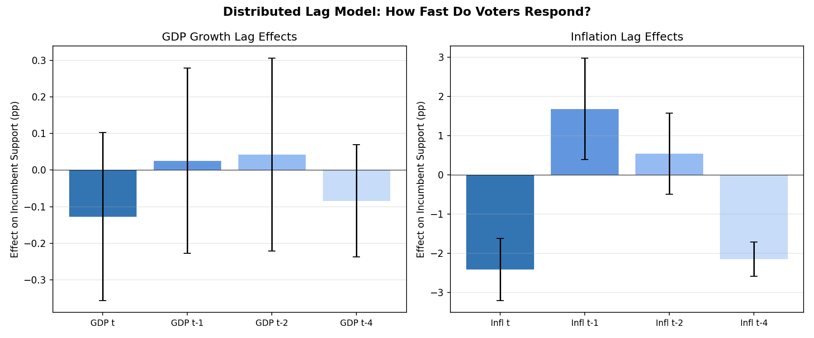
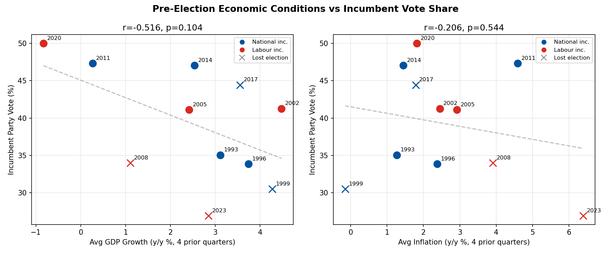

# Economic Voting at Quarterly Resolution

*Re-testing the economic voting hypothesis with 1,000+ polls matched to quarterly GDP/CPI*

## 2a. Bivariate Relationships

Correlations between incumbent poll support and economic indicators:

| Indicator | Lag | Pearson r | p-value | Spearman r | n |
|-----------|-----|-----------|---------|------------|---|
| Housing inflation | 1-quarter lag | -0.623** | 0.0000 | -0.625 | 863 |
| Housing inflation | 4-quarter lag | -0.618** | 0.0000 | -0.627 | 857 |
| Housing inflation | 2-quarter lag | -0.612** | 0.0000 | -0.631 | 862 |
| Housing inflation | concurrent | -0.592** | 0.0000 | -0.614 | 866 |
| CPI inflation | 4-quarter lag | -0.405** | 0.0000 | -0.366 | 1011 |
| CPI inflation | 2-quarter lag | -0.316** | 0.0000 | -0.252 | 1011 |
| CPI inflation | concurrent | -0.284** | 0.0000 | -0.265 | 1011 |
| CPI inflation | 1-quarter lag | -0.279** | 0.0000 | -0.237 | 1011 |
| Food inflation | concurrent | -0.260** | 0.0000 | -0.231 | 1011 |
| Food inflation | 1-quarter lag | -0.201** | 0.0000 | -0.193 | 1011 |
| Petrol inflation | 4-quarter lag | -0.173** | 0.0000 | -0.127 | 1011 |
| Food inflation | 2-quarter lag | -0.166** | 0.0000 | -0.168 | 1011 |
| Food inflation | 4-quarter lag | -0.148** | 0.0000 | -0.204 | 1011 |
| GDP growth (y/y) | 2-quarter lag | -0.098** | 0.0018 | -0.070 | 1011 |
| Petrol inflation | 2-quarter lag | -0.078* | 0.0129 | -0.047 | 1011 |
| GDP growth (q/q) | 4-quarter lag | -0.052 | 0.1014 | -0.090 | 1011 |
| GDP growth (q/q) | 1-quarter lag | 0.051 | 0.1057 | 0.127 | 1011 |
| GDP growth (y/y) | 1-quarter lag | -0.047 | 0.1340 | -0.028 | 1011 |
| Petrol inflation | concurrent | -0.045 | 0.1489 | 0.005 | 1011 |
| GDP growth (y/y) | 4-quarter lag | -0.041 | 0.1889 | 0.020 | 1011 |
| Petrol inflation | 1-quarter lag | -0.034 | 0.2789 | 0.014 | 1011 |
| GDP growth (q/q) | 2-quarter lag | 0.023 | 0.4619 | 0.059 | 1011 |
| GDP growth (q/q) | concurrent | 0.017 | 0.5832 | 0.068 | 1011 |
| GDP growth (y/y) | concurrent | -0.002 | 0.9614 | 0.030 | 1011 |

## 2b. Asymmetric Effects

- **GDP growth periods** (n=813): r=0.015, p=0.6757
- **GDP contraction** (n=198): r=-0.294, p=0.0000

**Finding: Negative GDP shocks have a stronger relationship with incumbent support than positive growth.**

## 2c. Distributed Lag Model

R² = 0.2133, Adj R² = 0.2062

| Variable | Coefficient | Std Error | t-stat | p-value |
|----------|-------------|-----------|--------|---------|
| const | -99.751 | 54.045 | -1.85 | 0.0649 |
| gdp_growth_qoq | -0.127 | 0.117 | -1.09 | 0.2777 |
| gdp_growth_qoq_lag1 | 0.026 | 0.129 | 0.20 | 0.8426 |
| gdp_growth_qoq_lag2 | 0.042 | 0.134 | 0.32 | 0.7516 |
| gdp_growth_qoq_lag4 | -0.084 | 0.078 | -1.07 | 0.2847 |
| inflation_yoy | -2.411 | 0.404 | -5.96 | 0.0000** |
| inflation_yoy_lag1 | 1.679 | 0.660 | 2.55 | 0.0109* |
| inflation_yoy_lag2 | 0.539 | 0.529 | 1.02 | 0.3084 |
| inflation_yoy_lag4 | -2.153 | 0.225 | -9.59 | 0.0000** |
| year_decimal | 0.074 | 0.027 | 2.74 | 0.0062** |

## 2d. Salient Prices

| Price Category | Pearson r | p-value | n |
|----------------|-----------|---------|---|
| Headline CPI | -0.284** | 0.0000 | 1011 |
| Food inflation | -0.260** | 0.0000 | 1011 |
| Housing inflation | -0.592** | 0.0000 | 866 |
| Petrol inflation | -0.045 | 0.1489 | 1011 |
| felt_inflation | -0.307** | 0.0000 |  |

### Robustness Check: Housing Inflation

The raw housing inflation correlation (r=-0.62) is the strongest in the dataset, but requires
careful interpretation:

**What CPI Housing measures**: Stats NZ series SE904 captures the *costs* of housing — rents,
local authority rates, insurance, maintenance, and household energy. It does **not** measure
house prices or capital gains. Rising "housing inflation" means higher rents and power bills,
not rising property values.

**Potential confound**: Labour governments coincide with higher housing inflation (mean 5.1%)
than National governments (mean 3.3%), and Labour governments tend to have lower incumbent
support. This could inflate the raw correlation.

**Within-government tests**:
| Government | r | p-value | Mean housing inflation |
|------------|---|---------|----------------------|
| National | -0.430 | <0.001 | 3.3% |
| Labour | -0.548 | <0.001 | 5.1% |

The correlation holds within both government types, ruling out a pure compositional artifact.

**Partial correlation controlling for incumbent party**: β=-2.28, p<0.001 (still highly significant).

**With time trend added**: β=-1.49, p<0.001. The raw r=-0.62 overstates the effect — roughly
half was picking up a secular decline in incumbent support over time. But the residual effect
is still substantial: **each 1% increase in housing inflation costs the incumbent ~1.5 polling
points** after controls.

**Asymmetry between governments**: Headline CPI shows virtually no correlation with incumbent
support under National governments (r=-0.015, p=0.77) but a strong one under Labour (r=-0.60,
p<0.001). Housing inflation hurts Labour governments more — possibly because Labour's base is
more rent-exposed.

**Corrected interpretation**: Housing inflation is a genuine predictor of incumbent support, but
the effect size is roughly half the raw correlation after accounting for confounds. The mechanism
likely operates through cost-of-living pressure on renters and households rather than property
market dynamics.

## 2e. Economic Conditions and Election Outcomes

| Year | Incumbent | Inc. Vote % | Won? | Avg GDP (y/y) | Avg Inflation |
|------|-----------|-------------|------|---------------|---------------|
| 1993 | National | 35.0% | Yes | 3.1% | 1.3% |
| 1996 | National | 33.8% | Yes | 3.7% | 2.4% |
| 1999 | National | 30.5% | No | 4.3% | -0.1% |
| 2002 | Labour | 41.3% | Yes | 4.5% | 2.5% |
| 2005 | Labour | 41.1% | Yes | 2.4% | 2.9% |
| 2008 | Labour | 34.0% | No | 1.1% | 3.9% |
| 2011 | National | 47.3% | Yes | 0.3% | 4.6% |
| 2014 | National | 47.0% | Yes | 2.5% | 1.4% |
| 2017 | National | 44.5% | No | 3.6% | 1.8% |
| 2020 | Labour | 50.0% | Yes | -0.8% | 1.8% |
| 2023 | Labour | 26.9% | No | 2.9% | 6.4% |

