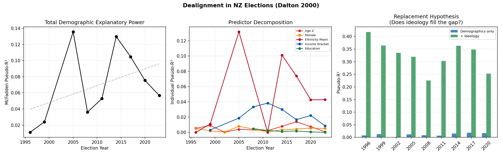
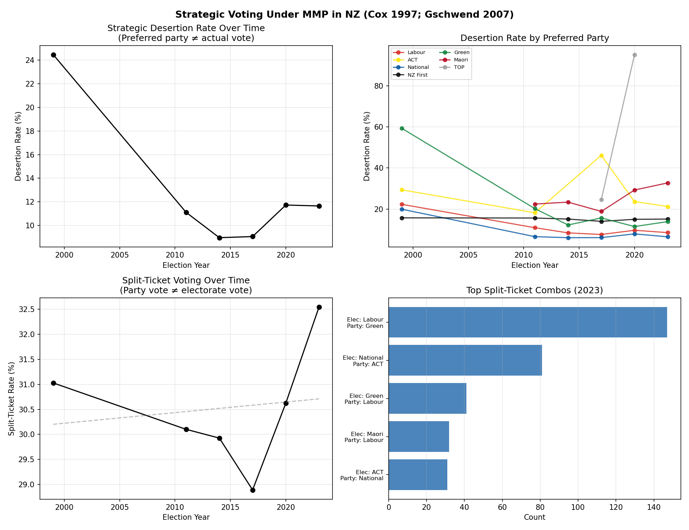

# Electoral Behavior Extensions

*Two hypotheses about dealignment and strategic voting in NZ*

## 3A. Dealignment (Dalton 2000; Ford & Jennings 2020)

**Question**: Is the total explanatory power of demographics on vote choice declining?

### Full Demographic Model R² by Election

| Year | Pseudo-R² | n | Predictors |
|------|-----------|---|-----------|
| 1996 | 0.0111 | 2754 | age_z, female, ethnicity_maori |
| 1999 | 0.0241 | 1492 | age_z, female, income_bracket, ethnicity_maori |
| 2005 | 0.1357 | 2184 | age_z, female, income_bracket, ethnicity_maori |
| 2008 | 0.0362 | 1429 | female, education, income_bracket |
| 2011 | 0.0528 | 295 | age_z, female, education, income_bracket, ethnicity_maori |
| 2014 | 0.1298 | 1496 | age_z, female, education, income_bracket, ethnicity_maori |
| 2017 | 0.1047 | 2079 | age_z, female, education, income_bracket, ethnicity_maori |
| 2020 | 0.0755 | 2305 | age_z, female, education, income_bracket, ethnicity_maori |
| 2023 | 0.0566 | 1049 | age_z, female, education, income_bracket, ethnicity_maori |

Trend in R² over time: r=0.425, p=0.2539

**Finding**: Demographics are becoming MORE predictive, suggesting realignment rather than dealignment in NZ.

### Individual Predictor R² Decomposition

| Year | age_z | education | ethnicity_maori | female | income_bracket |
|------|-----|-----|-----|-----|-----|
| 1996 | 0.0053 | — | 0.0001 | 0.0057 | — |
| 1999 | 0.0090 | — | 0.0110 | 0.0018 | 0.0031 |
| 2002 | 0.0002 | — | — | 0.0004 | — |
| 2005 | 0.0040 | — | 0.1318 | 0.0080 | 0.0187 |
| 2008 | — | 0.0048 | — | 0.0042 | 0.0334 |
| 2011 | 0.0022 | 0.0025 | 0.0000 | 0.0006 | 0.0383 |
| 2014 | 0.0078 | 0.0011 | 0.1012 | 0.0034 | 0.0301 |
| 2017 | 0.0139 | 0.0018 | 0.0739 | 0.0042 | 0.0166 |
| 2020 | 0.0075 | 0.0006 | 0.0427 | 0.0056 | 0.0222 |
| 2023 | 0.0007 | 0.0000 | 0.0428 | 0.0051 | 0.0085 |

### Replacement Hypothesis: Demographics + Ideology

| Year | Demo-only R² | + Ideology R² | Added R² |
|------|-------------|--------------|----------|
| 1996 | 0.0074 | 0.4177 | 0.4103 |
| 1999 | 0.0127 | 0.3643 | 0.3516 |
| 2002 | 0.0008 | 0.3354 | 0.3346 |
| 2005 | 0.0118 | 0.3193 | 0.3074 |
| 2008 | 0.0085 | 0.2251 | 0.2166 |
| 2011 | 0.0067 | 0.3033 | 0.2966 |
| 2014 | 0.0150 | 0.3632 | 0.3482 |
| 2017 | 0.0183 | 0.3488 | 0.3304 |
| 2020 | 0.0168 | 0.2531 | 0.2364 |

## 3B. Strategic Voting Under MMP (Cox 1997; Gschwend 2007)

**Question**: Do voters strategically desert minor parties? Do they split tickets?

### Strategic Desertion (Preferred ≠ Actual Vote)

| Year | n | Desertion Rate |
|------|---|---------------|
| 1999 | 2060 | 24.5% |
| 2011 | 2493 | 11.1% |
| 2014 | 2397 | 9.0% |
| 2017 | 3100 | 9.1% |
| 2020 | 3094 | 11.7% |
| 2023 | 1673 | 11.7% |

### Desertion by Preferred Party

| Year | Party | n | Desertion % | Top Destination |
|------|-------|---|------------|----------------|
| 1999 | Labour | 969 | 22.3% | National |
| 1999 | Alliance | 158 | 37.3% | Labour |
| 1999 | ACT | 109 | 29.4% | National |
| 1999 | National | 658 | 19.9% | ACT |
| 1999 | NZ First | 70 | 15.7% | Labour |
| 1999 | Green | 86 | 59.3% | Labour |
| 2011 | National | 1158 | 6.6% | Labour |
| 2011 | NZ First | 160 | 15.6% | Labour |
| 2011 | Green | 361 | 20.2% | Labour |
| 2011 | Labour | 678 | 10.9% | NZ First |
| 2011 | ACT | 22 | 18.2% | National |
| 2011 | Maori | 107 | 22.4% | NZ First |
| 2014 | National | 1206 | 6.1% | NZ First |
| 2014 | Labour | 560 | 8.4% | NZ First |
| 2014 | Green | 335 | 12.2% | Labour |
| 2014 | NZ First | 205 | 15.1% | Labour |
| 2014 | Maori | 77 | 23.4% | Labour |
| 2017 | Labour | 1182 | 7.6% | Green |
| 2017 | NZ First | 200 | 14.0% | Labour |
| 2017 | National | 1282 | 6.1% | NZ First |
| 2017 | Green | 236 | 15.7% | Labour |
| 2017 | Maori | 69 | 18.8% | Labour |
| 2017 | TOP | 118 | 24.6% | Labour |
| 2020 | Labour | 1791 | 9.7% | Green |
| 2020 | Green | 270 | 11.5% | Labour |
| 2020 | Maori | 82 | 29.3% | Labour |
| 2020 | National | 633 | 7.9% | ACT |
| 2020 | ACT | 237 | 23.6% | National |
| 2020 | TOP | 21 | 95.2% | Labour |
| 2020 | NZ First | 60 | 15.0% | Labour |
| 2023 | Labour | 458 | 8.5% | Green |
| 2023 | NZ First | 86 | 15.1% | National |
| 2023 | Maori | 113 | 32.7% | Labour |
| 2023 | National | 603 | 6.5% | ACT |
| 2023 | ACT | 132 | 21.2% | National |
| 2023 | Green | 281 | 13.9% | Labour |

Mean desertion rate — Minor parties: **25.8%**, Major parties: **10.0%**

**Finding**: Minor party supporters desert at higher rates, consistent with strategic voting theory (Cox 1997).

### Split-Ticket Voting (Party Vote ≠ Electorate Vote)

| Year | n | Split-Ticket Rate |
|------|---|------------------|
| 1999 | 1821 | 31.0% |
| 2011 | 2475 | 30.1% |
| 2014 | 2446 | 29.9% |
| 2017 | 3032 | 28.9% |
| 2020 | 3187 | 30.6% |
| 2023 | 1647 | 32.5% |

Trend: r=0.146, p=0.7825

**Finding**: No clear increase in split-ticket voting — MMP learning may have plateaued.

### Most Common Split-Ticket Combinations

| Year | Electorate Vote | Party Vote | Count |
|------|----------------|------------|-------|
| 1999 | Labour | Alliance | 80 |
| 1999 | National | ACT | 78 |
| 1999 | Labour | National | 71 |
| 2011 | Labour | Green | 163 |
| 2011 | Labour | NZ First | 100 |
| 2011 | Labour | National | 53 |
| 2014 | Labour | Green | 156 |
| 2014 | Labour | NZ First | 86 |
| 2014 | Labour | National | 63 |
| 2017 | Labour | Green | 133 |
| 2017 | Green | Labour | 104 |
| 2017 | Labour | NZ First | 73 |
| 2020 | Labour | Green | 199 |
| 2020 | National | ACT | 142 |
| 2020 | National | Labour | 135 |
| 2023 | Labour | Green | 147 |
| 2023 | National | ACT | 81 |
| 2023 | Green | Labour | 41 |

### Profile of Strategic Voters

| Year | n Loyal | n Strategic | Age (L/S) | Education (L/S) | L-R (L/S) |
|------|---------|-------------|-----------|-----------------|-----------|
| 1999 | 1556 | 504 | 48.1/44.5 | — | 5.0/5.1 |
| 2011 | 2216 | 277 | 53.6/56.5 | 1.7/1.7 | 5.5/4.8 |
| 2014 | 2182 | 215 | 55.7/56.6 | 1.7/1.4 | 5.8/5.3 |
| 2017 | 2819 | 281 | 55.3/54.9 | 1.7/1.9 | 5.2/5.0 |
| 2020 | 2731 | 363 | 52.7/53.5 | 1.7/1.8 | 5.1/5.5 |
| 2023 | 1478 | 195 | 55.8/56.8 | 1.9/2.0 | — |

