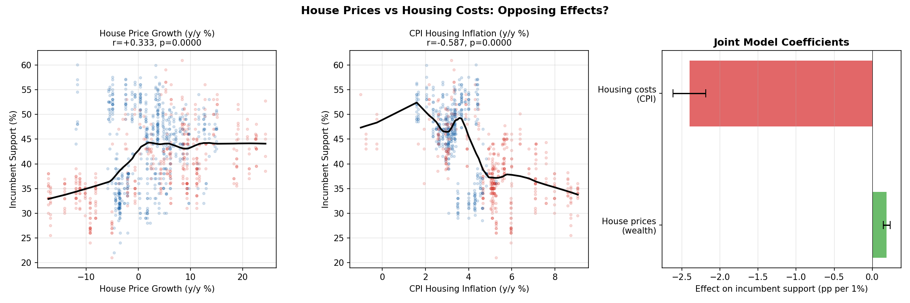
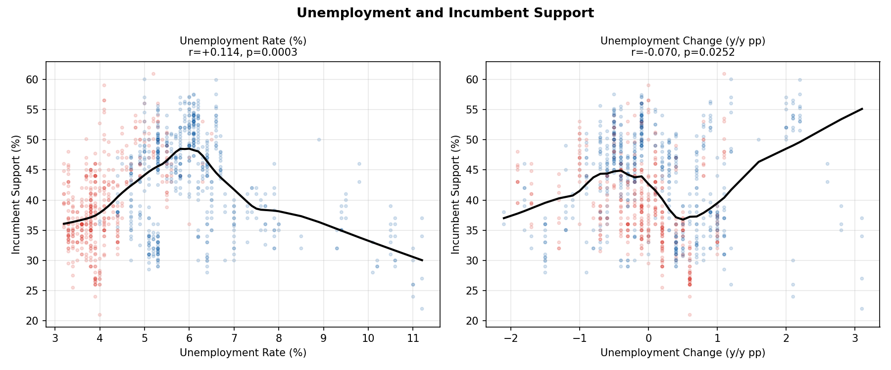
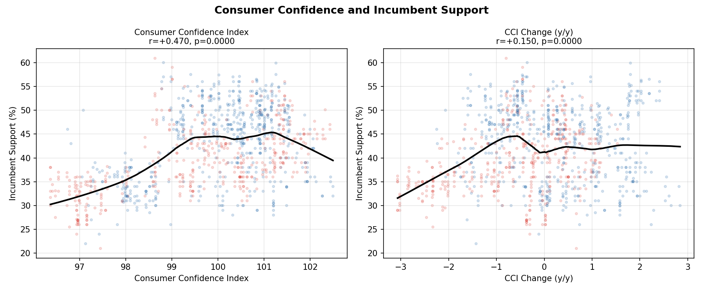
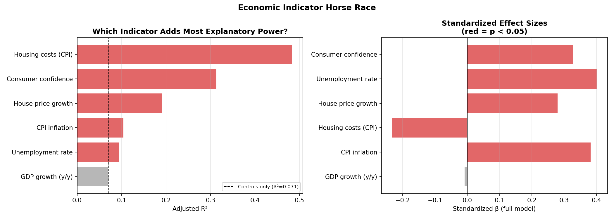
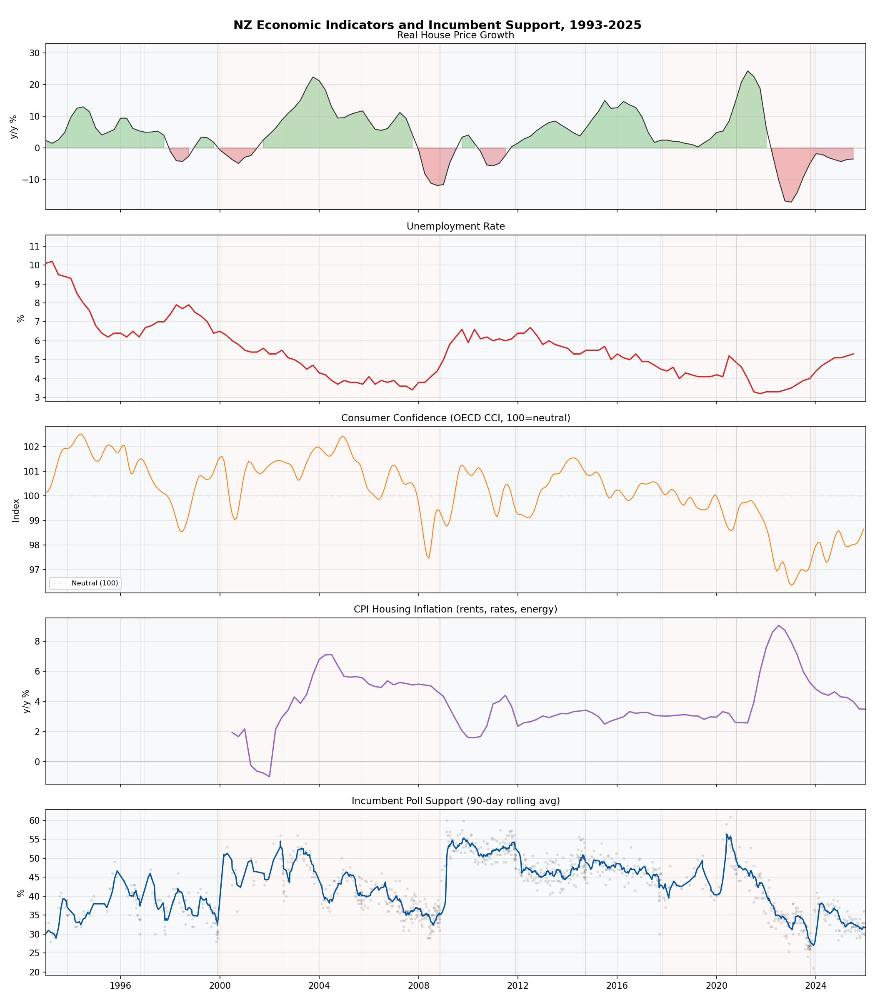

# Extended Economic Analysis: House Prices, Unemployment, and Consumer Confidence

*Adding three new datasets to the economic voting analysis*

---

## A. House Prices vs Housing Costs

**Key question**: CPI Housing (rents, rates, energy) hurts incumbents. Do rising *house prices* (wealth effect) help them?

### Bivariate Correlations

| Indicator | r | p-value | n |
|-----------|---|---------|---|
| House price growth (y/y) | +0.333*** | 0.0000 | 1015 |
| House price growth (4Q lag) | -0.025 | 0.4186 | 1015 |
| CPI Housing inflation | -0.587*** | 0.0000 | 870 |

### Joint Model (R² = 0.3873)

| Variable | β | SE | p-value |
|----------|---|-------|---------|
| hpi_growth_yoy | +0.189*** | 0.023 | 0.0000 |
| housing_inflation | -2.402*** | 0.110 | 0.0000 |

### Controlled Model (+ incumbent party + time trend, R² = 0.5204)

| Variable | β | SE | p-value |
|----------|---|-------|---------|
| hpi_growth_yoy | +0.179*** | 0.021 | 0.0000 |
| housing_inflation | -1.177*** | 0.157 | 0.0000 |
| incumbent_is_national | +5.946*** | 0.567 | 0.0000 |
| year_decimal | -0.390*** | 0.036 | 0.0000 |

---

## B. Unemployment

### Bivariate Correlations

| Indicator | r | p-value | n |
|-----------|---|---------|---|
| Unemployment rate (level) | +0.114*** | 0.0003 | 1015 |
| Unemployment change (y/y) | -0.070* | 0.0252 | 1015 |
| rising_unemp | +0.191*** | 0.0000 | 446 |
| falling_unemp | +0.200*** | 0.0000 | 569 |

### Controlled Model (R² = 0.0979)

| Variable | β | SE | p-value |
|----------|---|-------|---------|
| unemployment_rate | -1.592*** | 0.338 | 0.0000 |
| incumbent_is_national | +7.250*** | 0.875 | 0.0000 |
| year_decimal | -0.174*** | 0.043 | 0.0000 |

---

## C. Consumer Confidence

### Bivariate Correlations

| Indicator | r | p-value | n |
|-----------|---|---------|---|
| Consumer confidence (level) | +0.470*** | 0.0000 | 1015 |
| CCI change (y/y) | +0.150*** | 0.0000 | 1015 |
| CCI 3-month lag | +0.480*** | 0.0000 | 1015 |
| within_national | +0.337*** | 0.0000 | 576 |
| within_labour | +0.590*** | 0.0000 | 439 |

### Controlled Model (R² = 0.3154)

| Variable | β | SE | p-value |
|----------|---|-------|---------|
| cci | +3.204*** | 0.167 | 0.0000 |
| incumbent_is_national | +2.895*** | 0.411 | 0.0000 |
| year_decimal | +0.254*** | 0.031 | 0.0000 |

---

## D. Horse Race: Which Indicator Wins?

### Univariate Models (each indicator + controls)

| Indicator | β | p-value | Adj R² | n |
|-----------|---|---------|--------|---|
| Housing costs (CPI) | -1.495*** | 0.0000 | 0.4837 | 870 |
| Consumer confidence | +3.204*** | 0.0000 | 0.3134 | 1015 |
| House price growth | +0.330*** | 0.0000 | 0.1900 | 1015 |
| CPI inflation | -0.973*** | 0.0000 | 0.1041 | 1015 |
| Unemployment rate | -1.592*** | 0.0000 | 0.0952 | 1015 |
| GDP growth (y/y) | +0.095 | 0.3556 | 0.0697 | 1015 |

### Full Model — All Indicators Together (R² = 0.6108, Adj R² = 0.6072)

| Variable | β | SE | p-value |
|----------|---|-------|---------|
| incumbent_is_national | +2.073* | 0.941 | 0.0275 |
| year_decimal | -0.117* | 0.054 | 0.0317 |
| gdp_growth_yoy | -0.023 | 0.091 | 0.7998 |
| inflation_yoy | +1.662*** | 0.164 | 0.0000 |
| housing_inflation | -1.066*** | 0.205 | 0.0000 |
| hpi_growth_yoy | +0.244*** | 0.030 | 0.0000 |
| unemployment_rate | +3.172*** | 0.422 | 0.0000 |
| cci | +1.758*** | 0.224 | 0.0000 |

