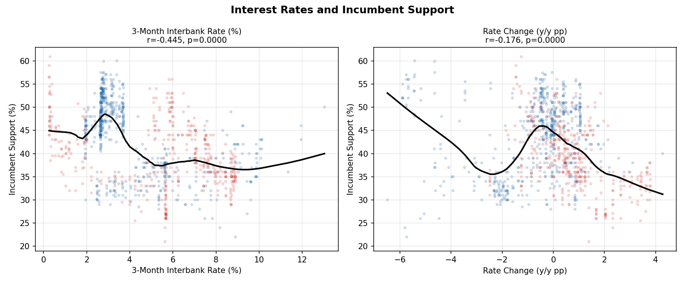
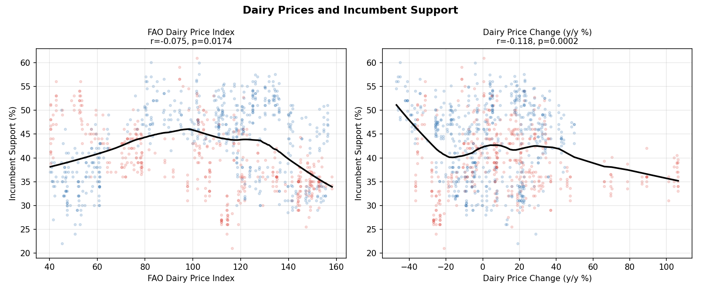
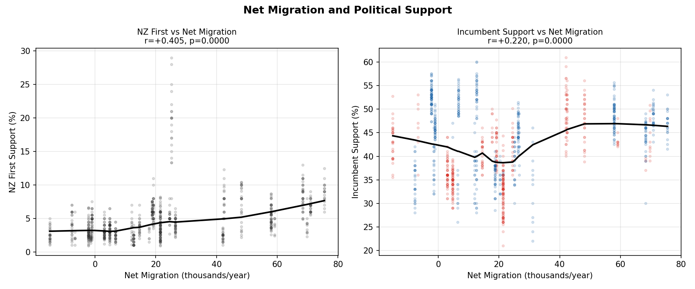
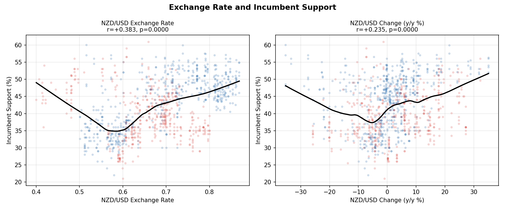
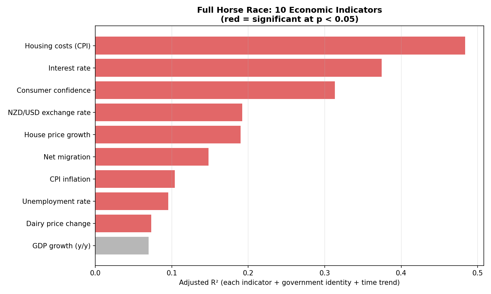
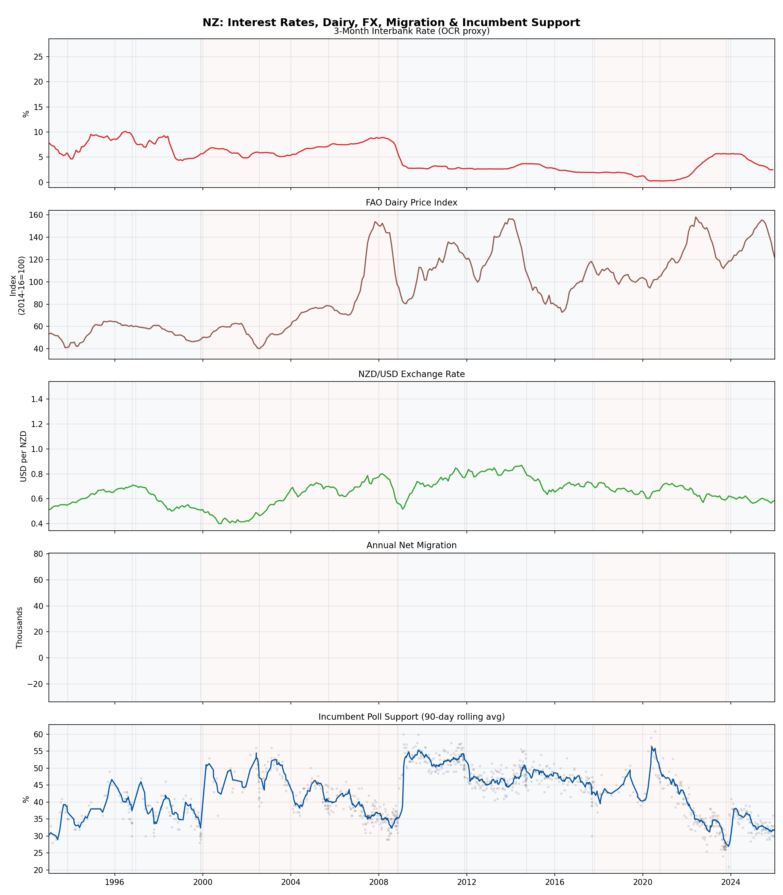

# Extended Economic Analysis Part 2: Interest Rates, Dairy, Migration, Exchange Rate

*Four additional datasets tested against incumbent polling support*

---

## A. Interest Rates

### Bivariate Correlations

| Indicator | r | p-value | n |
|-----------|---|---------|---|
| Interest rate (level) | -0.445*** | 0.0000 | 1015 |
| Interest rate change (y/y) | -0.176*** | 0.0000 | 1015 |

### Housing Trinity Model (interest rate + housing costs + house prices, R² = 0.4374)

| Variable | β | SE | p-value |
|----------|---|-------|---------|
| interest_rate | -0.808*** | 0.076 | 0.0000 |
| housing_inflation | -1.999*** | 0.098 | 0.0000 |
| hpi_growth_yoy | +0.174*** | 0.023 | 0.0000 |

---

## B. Dairy Prices

### Bivariate Correlations

| Indicator | r | p-value | n |
|-----------|---|---------|---|
| Dairy price index (level) | -0.075* | 0.0174 | 1015 |
| Dairy price change (y/y %) | -0.118*** | 0.0002 | 1014 |

---

## C. Net Migration and NZ First Support

**Key finding**: High net migration predicts higher NZ First support (r = +0.41, p < 0.001).
This is the expected direction — NZ First capitalises on anti-immigration sentiment, which
is strongest when immigration is visibly high.

### Correlations

| Measure | r | p-value | n |
|---------|---|---------|---|
| NZ First vs net migration | +0.388 | < 0.001 | 924 |
| NZ First vs migration (1-year lag) | +0.303 | < 0.001 | 967 |
| Incumbent support vs migration | +0.220 | < 0.001 | 968 |

### Within-Government Tests

The correlation holds within both governments, ruling out era confounding:

| Government | r | p-value | n |
|------------|---|---------|---|
| National | +0.376 | < 0.001 | 494 |
| Labour | +0.389 | < 0.001 | 430 |

### NZ First Support and Migration by Era

| Period | Context | NZF support | Net migration |
|--------|---------|-------------|---------------|
| 1996-99 | NZF in coalition | 7.3% | 6k/yr |
| 2000-05 | NZF out then in | 6.1% | 29k/yr |
| 2006-08 | NZF in govt | 3.3% | 6k/yr |
| 2009-14 | NZF in opposition | 3.8% | 19k/yr |
| 2015-17 | NZF in opposition, migration surge | **8.0%** | **71k/yr** |
| 2018-20 | NZF in coalition | 3.1% | 52k/yr |
| 2021-25 | COVID era, Lab then Nat | 4.1% | 14k/yr |

The 2015-17 vs 2018-20 comparison is revealing: migration stayed high in both periods,
but NZ First's support collapsed when they entered government. This suggests migration
*salience* drives NZ First support, but NZ First's ability to capitalise depends on being
in opposition. Being part of the government presiding over high immigration kills the
protest vote.

---

## D. Exchange Rate

### Bivariate Correlations

| Indicator | r | p-value | n |
|-----------|---|---------|---|
| NZD/USD level | +0.383*** | 0.0000 | 1015 |
| NZD/USD change (y/y %) | +0.235*** | 0.0000 | 1015 |

---

## E. Full Horse Race: 10 Indicators

### Univariate Models (each indicator + controls)

| Rank | Indicator | β | p-value | Adj R² | n |
|------|-----------|---|---------|--------|---|
| 1 | Housing costs (CPI) | -1.495*** | 0.0000 | 0.4837 | 870 |
| 2 | Interest rate | -2.358*** | 0.0000 | 0.3744 | 1015 |
| 3 | Consumer confidence | +3.204*** | 0.0000 | 0.3134 | 1015 |
| 4 | NZD/USD exchange rate | +27.923*** | 0.0000 | 0.1919 | 1015 |
| 5 | House price growth | +0.330*** | 0.0000 | 0.1900 | 1015 |
| 6 | Net migration | +0.000*** | 0.0000 | 0.1481 | 968 |
| 7 | CPI inflation | -0.973*** | 0.0000 | 0.1041 | 1015 |
| 8 | Unemployment rate | -1.592*** | 0.0000 | 0.0952 | 1015 |
| 9 | Dairy price change | -0.020** | 0.0051 | 0.0732 | 1014 |
| 10 | GDP growth (y/y) | +0.095 | 0.3556 | 0.0697 | 1015 |

