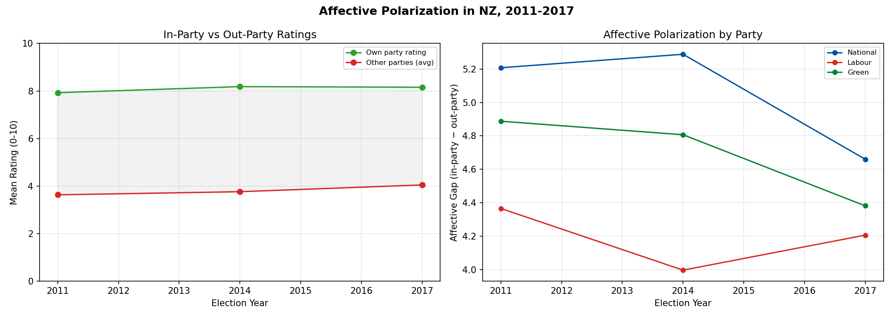

# Ideological Dynamics in New Zealand

*Has the NZ electorate shifted or polarized? (NZES left-right data, 1996-2020)*

## 4a. Electorate-Level Trends

| Year | Mean L-R | Median | Std Dev | IQR | n |
|------|----------|--------|---------|-----|---|
| 1996 | 5.57 | 5.0 | 2.42 | 4.0 | 3303 |
| 1999 | 5.01 | 5.0 | 2.34 | 4.0 | 1668 |
| 2002 | 5.16 | 5.0 | 2.29 | 3.0 | 3870 |
| 2005 | 5.23 | 5.0 | 2.48 | 4.0 | 2966 |
| 2008 | 5.48 | 5.0 | 2.36 | 3.0 | 2339 |
| 2011 | 5.44 | 5.0 | 2.47 | 3.0 | 2370 |
| 2014 | 5.71 | 5.0 | 2.43 | 4.0 | 2269 |
| 2017 | 5.22 | 5.0 | 2.52 | 4.0 | 2807 |
| 2020 | 5.25 | 5.0 | 2.53 | 4.0 | 2827 |

## 4b. Polarization by Party Voters

National-Labour voter ideological distance:

| Year | National voters | Labour voters | Distance |
|------|-----------------|---------------|----------|
| 1996 | 7.25 | 3.92 | 3.33 |
| 1999 | 6.73 | 3.72 | 3.01 |
| 2002 | 7.02 | 4.05 | 2.97 |
| 2005 | 7.11 | 4.02 | 3.10 |
| 2008 | 6.76 | 4.45 | 2.31 |
| 2011 | 6.98 | 4.09 | 2.89 |
| 2014 | 7.23 | 4.12 | 3.11 |
| 2017 | 6.94 | 3.73 | 3.21 |
| 2020 | 7.24 | 4.49 | 2.75 |

## 4c. Party Perception Shifts

Where voters place each party on the L-R scale:

| Year | Green | Labour | National |
|------|------|------|------|
| 1996 | — | 3.84 | 7.68 |
| 1999 | — | 3.35 | 7.65 |
| 2002 | — | 3.71 | 7.07 |
| 2005 | — | 3.57 | 7.08 |
| 2008 | — | 3.74 | 6.84 |
| 2011 | 3.27 | 3.46 | 7.22 |
| 2014 | 2.93 | 3.24 | 7.21 |
| 2017 | 2.63 | 3.38 | 7.29 |
| 2020 | 2.37 | 3.77 | 7.09 |
| 2023 | 2.19 | 3.25 | 7.20 |

## 4d. Affective Polarization

Average in-party vs out-party ratings:

| Year | In-Party | Out-Party | Affective Gap |
|------|----------|-----------|---------------|
| 2011 | 7.93 | 3.63 | 4.30 |
| 2014 | 8.18 | 3.76 | 4.43 |
| 2017 | 8.16 | 4.04 | 4.11 |

