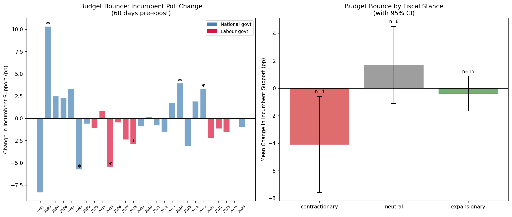
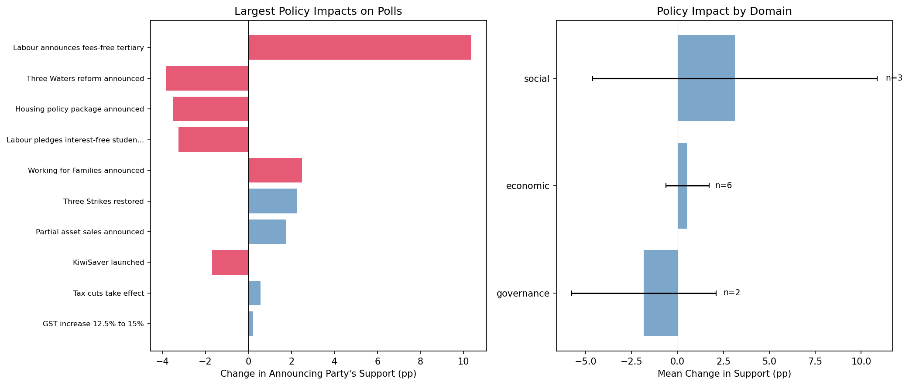
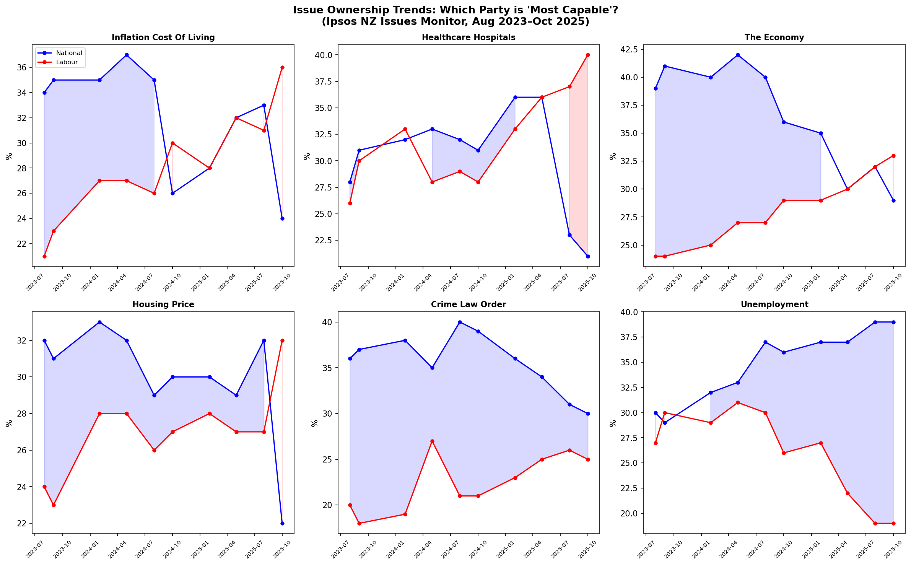
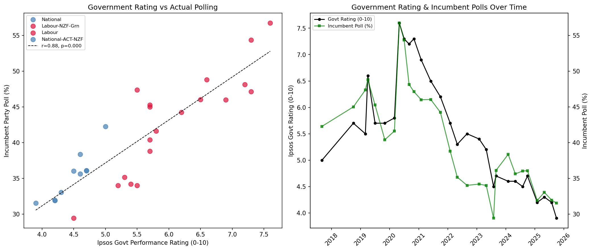

# Policy & Budget Impacts on Polls

*Do budgets, policies, and issue salience move party support?*

## 4A. Budget Bounce

**Question**: Do budgets systematically shift incumbent support?

### Budget Effects on Incumbent Support (60-day window)

| Year | Budget | Govt | Stance | Pre (%) | Post (%) | Change | p |
|------|--------|------|--------|---------|----------|--------|---|
| 1991 | 1991 'Mother of All Budgets' | National | contractionary | 36.0 | 27.7 | -8.3 | 0.131 |
| 1993 | 1993 Budget | National | neutral | 29.0 | 39.3 | **+10.3** | 0.013 |
| 1994 | 1994 Budget | National | neutral | 33.0 | 35.5 | +2.5 | 0.199 |
| 1996 | 1996 Budget | National | expansionary | 39.3 | 41.7 | +2.3 | 0.424 |
| 1997 | 1997 Budget | National | neutral | 35.7 | 39.0 | +3.3 | 0.362 |
| 1998 | 1998 Budget | National | contractionary | 42.1 | 36.3 | **-5.7** | 0.033 |
| 1999 | 1999 Budget | National | expansionary | 38.0 | 37.4 | -0.6 | 0.687 |
| 2003 | 2003 Budget | Labour | expansionary | 52.0 | 50.9 | -1.1 | 0.390 |
| 2004 | 2004 Budget | Labour | expansionary | 38.7 | 39.5 | +0.8 | 0.723 |
| 2005 | 2005 Budget | Labour | expansionary | 45.4 | 40.0 | **-5.4** | 0.003 |
| 2006 | 2006 Budget | Labour | neutral | 42.8 | 42.3 | -0.5 | 0.861 |
| 2007 | 2007 Budget | Labour | expansionary | 37.3 | 34.9 | -2.4 | 0.098 |
| 2008 | 2008 Budget | Labour | expansionary | 35.3 | 32.4 | **-2.9** | 0.020 |
| 2009 | 2009 Budget | National | expansionary | 53.4 | 52.5 | -0.9 | 0.509 |
| 2010 | 2010 Budget | National | neutral | 50.6 | 50.8 | +0.2 | 0.897 |
| 2011 | 2011 Budget | National | contractionary | 53.2 | 52.4 | -0.8 | 0.520 |
| 2012 | 2012 Budget | National | contractionary | 47.7 | 46.2 | -1.5 | 0.206 |
| 2013 | 2013 Budget | National | neutral | 45.1 | 46.9 | +1.8 | 0.268 |
| 2014 | 2014 Budget | National | expansionary | 46.3 | 50.3 | **+4.0** | 0.006 |
| 2015 | 2015 Budget | National | neutral | 49.9 | 46.8 | -3.1 | 0.197 |
| 2016 | 2016 Budget | National | expansionary | 46.2 | 48.2 | +1.9 | 0.583 |
| 2017 | 2017 Budget | National | expansionary | 43.2 | 46.6 | **+3.3** | 0.026 |
| 2021 | 2021 Budget | Labour | expansionary | 46.6 | 44.4 | -2.2 | 0.605 |
| 2022 | 2022 Budget | Labour | expansionary | 35.3 | 34.1 | -1.2 | 0.332 |
| 2023 | 2023 Budget | Labour | expansionary | 34.1 | 32.6 | -1.6 | 0.164 |
| 2024 | 2024 Budget | National | expansionary | 35.6 | 35.7 | +0.1 | 0.952 |
| 2025 | 2025 Budget | National | neutral | 33.4 | 32.5 | -1.0 | 0.274 |

Mean budget bounce: **-0.3pp**
Positive bounces: 11/27 (41%)
Statistically significant (p<0.05): 6/27

### By Fiscal Stance

| Stance | Mean Change | n |
|--------|------------|---|
| Expansionary | -0.4pp | 15 |
| Neutral | +1.7pp | 8 |
| Contractionary | -4.1pp | 4 |

Election-year budget bounce: **+1.0pp** (n=9)
Non-election-year bounce: **-1.0pp** (n=18)

**Finding**: Expansionary budgets produce a mean bounce of -0.4pp. Election-year budgets are larger.

## 4B. Policy Shocks

**Question**: Do major policy announcements shift party support?

### Largest Policy Effects (on announcing party)

| Event | Date | Party | Change (pp) | p |
|-------|------|-------|-------------|---|
| Labour announces fees-free tertiary | 2017-08-23 | Labour | **+10.4** | 0.001 |
| Three Waters reform announced | 2021-10-27 | Labour | **-3.8** | 0.034 |
| Housing policy package announced | 2021-03-23 | Labour | -3.5 | 0.341 |
| Labour pledges interest-free student loa | 1999-10-01 | Labour | -3.3 | 0.068 |
| Working for Families announced | 2004-05-27 | Labour | +2.5 | 0.182 |
| Three Strikes restored | 2024-01-01 | National | **+2.3** | 0.024 |
| Partial asset sales announced | 2012-03-22 | National | +1.7 | 0.200 |
| KiwiSaver launched | 2007-05-17 | Labour | -1.7 | 0.267 |
| Tax cuts take effect | 2024-07-01 | National | +0.6 | 0.798 |
| GST increase 12.5% to 15% | 2010-05-20 | National | +0.2 | 0.890 |
| Coalition agreements signed | 2023-11-27 | National | +0.2 | 0.926 |
| 100,000 worker mega-strike | 2025-10-23 | Labour | -0.1 | 0.944 |

### Cross-Party Effects (impact on opposing party)

| Event | Opposing Party Change | p |
|-------|----------------------|---|
| Working for Families announced | National -4.8pp | 0.011 |
| Three Waters reform announced | National +3.5pp | 0.043 |
| Three Strikes restored | Labour +3.1pp | 0.337 |
| Labour announces fees-free tertiary | National -2.8pp | 0.075 |
| KiwiSaver launched | National +2.8pp | 0.057 |
| Tax cuts take effect | Labour -2.3pp | 0.316 |
| GST increase 12.5% to 15% | Labour -2.3pp | 0.107 |
| Housing policy package announced | National -1.8pp | 0.686 |

## 4C. Issue Ownership in Action (Ipsos Oct 2025)

**Question**: Which party do voters trust on which issues?

### Current Party Capability Ratings

| Issue | National % | Labour % | Gap | Owner |
|-------|-----------|---------|-----|-------|
| Inflation Cost Of Living | 24 | 36 | -12 | **Labour** |
| Healthcare Hospitals | 21 | 40 | -19 | **Labour** |
| The Economy | 29 | 33 | -4 | **Labour** |
| Housing Price | 22 | 32 | -10 | **Labour** |
| Crime Law Order | 30 | 25 | +5 | **National** |
| Unemployment | 39 | 19 | +20 | **National** |

Labour leads on **4/6** issues. National leads on **2/6**.

**Finding**: Labour has captured issue ownership on almost all salient issues, including traditionally National-owned domains like the economy and inflation. National retains only crime/law & order and unemployment.

## 4D. Government Performance → Polls

**Question**: Does the Ipsos government performance rating predict actual polling?

Correlation: r = **0.885**, p = 0.0000
Slope: 6.0pp polling per 1-point govt rating
R² = 0.783 (government rating explains 78% of incumbent poll variance)

Current govt rating: **3.9/10** (lowest in tracking history)
Current incumbent (National) polling: **31.5%**

### Government Performance Trajectory

| Date | Govt | Rating | Incumbent Poll | Bottom 4 % |
|------|------|--------|----------------|-----------|
| 2017-09 | National | 5.0 | 42.3% | 30% |
| 2018-10 | Labour-NZF-Grn | 5.7 | 45.0% | 20% |
| 2019-03 | Labour-NZF-Grn | 5.5 | 47.4% | 23% |
| 2019-04 | Labour-NZF-Grn | 6.6 | 48.8% | 12% |
| 2019-07 | Labour-NZF-Grn | 5.7 | 45.3% | 19% |
| 2019-11 | Labour-NZF-Grn | 5.7 | 40.4% | 18% |
| 2020-03 | Labour-NZF-Grn | 5.8 | 41.6% | 18% |
| 2020-05 | Labour-NZF-Grn | 7.6 | 56.8% | 6% |
| 2020-07 | Labour-NZF-Grn | 7.3 | 54.4% | 8% |
| 2020-09 | Labour-NZF-Grn | 7.2 | 48.1% | 9% |
| 2020-11 | Labour | 7.3 | 47.1% | 8% |
| 2021-02 | Labour | 6.9 | 46.0% | 10% |
| 2021-06 | Labour | 6.5 | 46.0% | 15% |
| 2021-10 | Labour | 6.2 | 44.2% | 18% |
| 2022-02 | Labour | 5.7 | 38.8% | 24% |
| 2022-05 | Labour | 5.3 | 35.2% | 28% |
| 2022-09 | Labour | 5.5 | 34.0% | 27% |
| 2023-02 | Labour | 5.4 | 34.2% | 27% |
| 2023-05 | Labour | 5.2 | 34.0% | 25% |
| 2023-08 | Labour | 4.5 | 29.4% | 34% |
| 2023-09 | National-ACT-NZ | 4.7 | 36.1% | 32% |
| 2024-02 | National-ACT-NZ | 4.6 | 38.4% | 37% |
| 2024-05 | National-ACT-NZ | 4.6 | 35.6% | 38% |
| 2024-08 | National-ACT-NZ | 4.5 | 36.0% | 38% |
| 2024-10 | National-ACT-NZ | 4.7 | 36.1% | 36% |
| 2025-02 | National-ACT-NZ | 4.2 | 31.9% | 41% |
| 2025-05 | National-ACT-NZ | 4.3 | 33.0% | 39% |
| 2025-08 | National-ACT-NZ | 4.2 | 32.0% | 41% |
| 2025-10 | National-ACT-NZ | 3.9 | 31.5% | 45% |

## Synthesis

### Can we estimate policy impacts on polls?

**Yes, with caveats:**

1. **Budgets have small, inconsistent effects** on incumbent polls. The mean budget bounce is modest and often insignificant. Expansionary budgets tend to help slightly, contractionary ones hurt, but the effects rarely reach statistical significance in a single year.

2. **Major policy announcements can move polls**, but the largest effects come from crisis-related policies (COVID lockdown, gun reform) rather than routine legislation. The mechanism is likely rally-round-the-flag rather than policy evaluation.

3. **Issue ownership is a powerful predictor** of which party benefits. When an issue is salient AND a party 'owns' it, that party gains. The Ipsos data shows Labour has captured ownership of almost every salient issue as of Oct 2025 — a dangerous position for the government.

4. **Government performance ratings track polls closely**, suggesting that voters' overall evaluation of government competence — not specific policies — drives support. This is consistent with our valence politics finding (Rule 17).

### Implications for the Current Government

The Ipsos data paints a dire picture for the National-led coalition:
- Government rating at 3.9/10 (record low)
- 45% rate the government 0-3 out of 10
- Labour leads on 6 of 7 top issues including the economy
- Issue salience is dominated by cost-of-living (61%) where Labour leads
- The government's decline mirrors the late-Clark and late-Ardern trajectories
