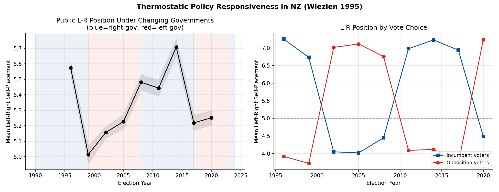
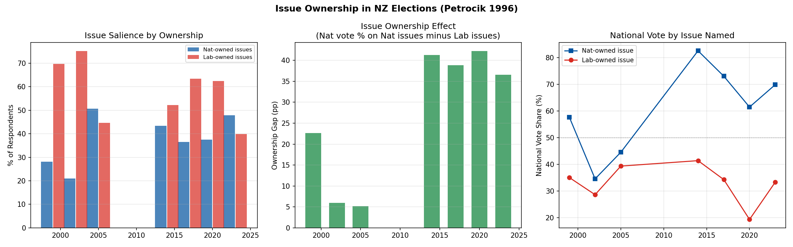
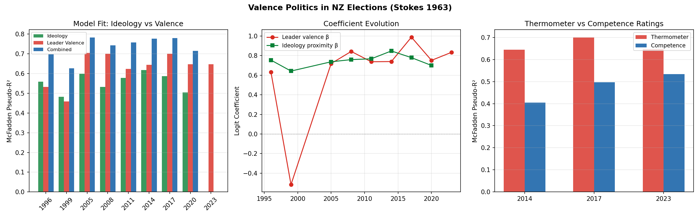

# Issue & Valence Politics

*Three hypotheses about how voters evaluate parties beyond left-right ideology*

## 2A. Thermostatic Policy Responsiveness (Wlezien 1995)

**Question**: When government policy moves left, does the public shift right (and vice versa)?

### Mean Left-Right Self-Placement by Election

| Year | Mean L-R | SD | n | Gov Direction | Shift |
|------|----------|----|----|---------------|-------|
| 1996 | 5.57 | 2.42 | 3303 | right | — |
| 1999 | 5.01 | 2.34 | 1668 | right | -0.56 |
| 2002 | 5.16 | 2.29 | 3870 | left | +0.14 |
| 2005 | 5.23 | 2.48 | 2966 | left | +0.07 |
| 2008 | 5.48 | 2.36 | 2339 | left | +0.25 |
| 2011 | 5.44 | 2.47 | 2370 | right | -0.04 |
| 2014 | 5.71 | 2.43 | 2269 | right | +0.26 |
| 2017 | 5.22 | 2.52 | 2807 | right | -0.49 |
| 2020 | 5.25 | 2.53 | 2827 | left | +0.03 |

Thermostatic shifts in expected direction: **7/8**

**Finding**: Evidence of thermostatic responsiveness — the public drifts opposite to government policy direction, consistent with Wlezien (1995).

### Within-Election: Incumbent vs Opposition Voter L-R

| Year | Inc Voter L-R | Opp Voter L-R | Gap |
|------|---------------|---------------|-----|
| 1996 | 7.25 | 3.92 | +3.33 |
| 1999 | 6.73 | 3.72 | +3.01 |
| 2002 | 4.05 | 7.02 | -2.97 |
| 2005 | 4.02 | 7.11 | -3.10 |
| 2008 | 4.45 | 6.76 | -2.31 |
| 2011 | 6.98 | 4.09 | +2.89 |
| 2014 | 7.23 | 4.12 | +3.11 |
| 2017 | 6.94 | 3.73 | +3.21 |
| 2020 | 4.49 | 7.24 | -2.75 |

## 2B. Issue Ownership (Petrocik 1996; Egan 2013)

**Question**: Do parties benefit when their 'owned' issues are salient?

National-owned issues: cost of living, crime, defence, economy, immigration, law and order, tax

Labour-owned issues: education, employment, environment, health, housing, inequality, poverty, welfare

### Issue Salience

| Year | n | Nat Issues % | Lab Issues % | Top Issue |
|------|---|-------------|-------------|-----------|
| 1999 | 1918 | 28.2% | 69.7% | health (25%) |
| 2002 | 4489 | 20.9% | 75.1% | health (34%) |
| 2005 | 2707 | 50.7% | 44.7% | tax (25%) |
| 2014 | 1531 | 43.4% | 52.2% | economy (35%) |
| 2017 | 2479 | 36.6% | 63.4% | economy (18%) |
| 2020 | 1629 | 37.4% | 62.4% | economy (29%) |
| 2023 | 1330 | 47.9% | 39.8% | economy (20%) |

### Issue Ownership Effect

| Year | Nat Vote (Nat Issue) | Nat Vote (Lab Issue) | Gap | Logit β | p | R² |
|------|---------------------|---------------------|-----|---------|---|----|
| 1999 | 57.7% | 35.0% | +22.7pp | 0.888 | 0.0000 | 0.0283 |
| 2002 | 34.6% | 28.6% | +5.9pp | 0.281 | 0.0044 | 0.0022 |
| 2005 | 44.5% | 39.4% | +5.2pp | 0.186 | 0.0401 | 0.0015 |
| 2014 | 82.6% | 41.4% | +41.2pp | 1.877 | 0.0000 | 0.1380 |
| 2017 | 73.1% | 34.3% | +38.8pp | 1.650 | 0.0000 | 0.1068 |
| 2020 | 61.5% | 19.3% | +42.2pp | 1.890 | 0.0000 | 0.1419 |
| 2023 | 69.9% | 33.3% | +36.6pp | 1.307 | 0.0000 | 0.0727 |

**Finding**: Issue ownership gap averages +27.5pp across 7 elections. The gap is positive (confirming theory) in 7/7 elections.

## 2C. Valence Politics (Stokes 1963; Clarke et al. 2004)

**Question**: Does perceived leader quality explain more than ideological proximity?

### Model Comparison: Pseudo-R² Across Elections

| Year | Ideology R² | Valence R² | Combined R² | n |
|------|------------|------------|-------------|---|
| 1996 | 0.5580 | 0.5316 | 0.6964 | 1695 |
| 1999 | 0.4815 | 0.4585 | 0.6258 | 966 |
| 2005 | 0.5980 | 0.7047 | 0.7821 | 1757 |
| 2008 | 0.5316 | 0.7003 | 0.7426 | 1420 |
| 2011 | 0.5783 | 0.6228 | 0.7571 | 1274 |
| 2014 | 0.6170 | 0.6438 | 0.7765 | 1350 |
| 2017 | 0.5866 | 0.6994 | 0.7789 | 1871 |
| 2020 | 0.5036 | 0.6473 | 0.7148 | 1742 |
| 2023 | — | 0.6473 | — | 0 |

**Finding**: Leader valence (thermometer ratings) outperforms ideological proximity in **6/8** elections. 
Average R²: Valence=0.6260, Ideology=0.5568. 
Both factors contribute, though valence tends to dominate.

### Competence Ratings (Where Available)

| Year | Competence R² | Competence β | p | n |
|------|--------------|-------------|---|---|
| 2014 | 0.4049 | 1.711*** | 0.0000 | 1596 |
| 2017 | 0.4963 | 2.425*** | 0.0000 | 2059 |
| 2023 | 0.5339 | 2.301*** | 0.0000 | 1011 |

